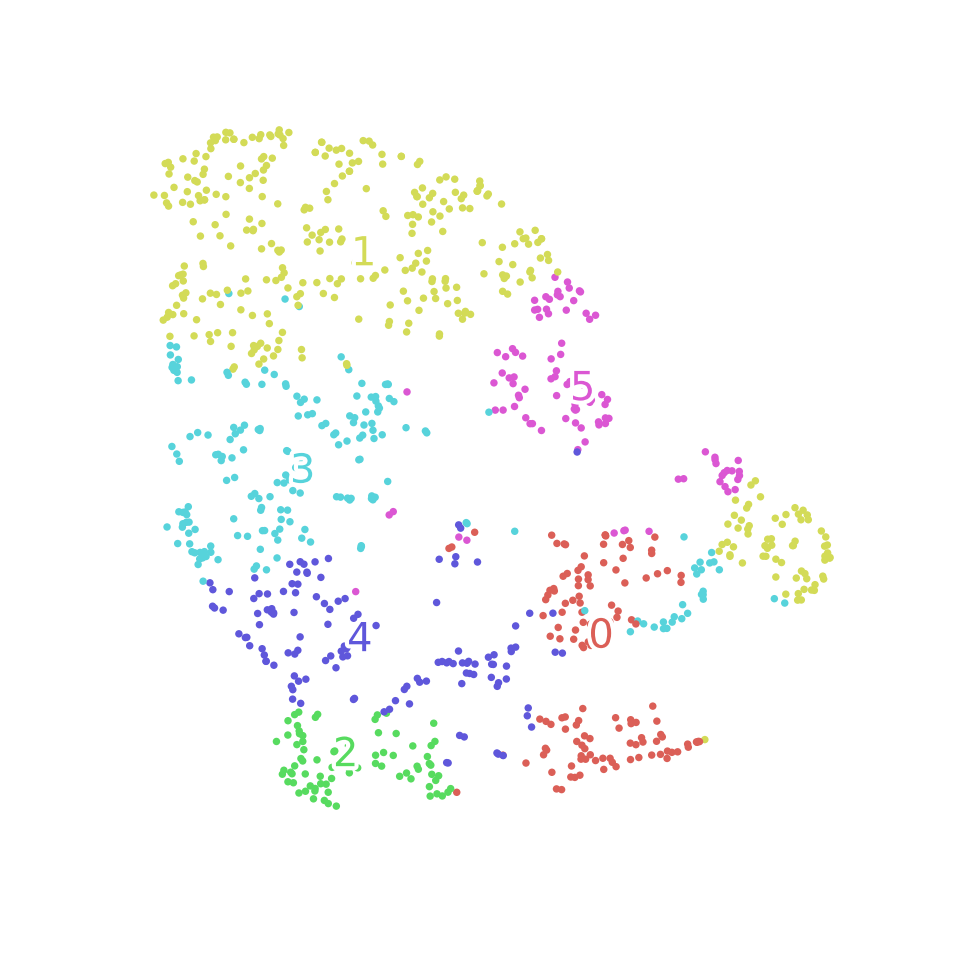
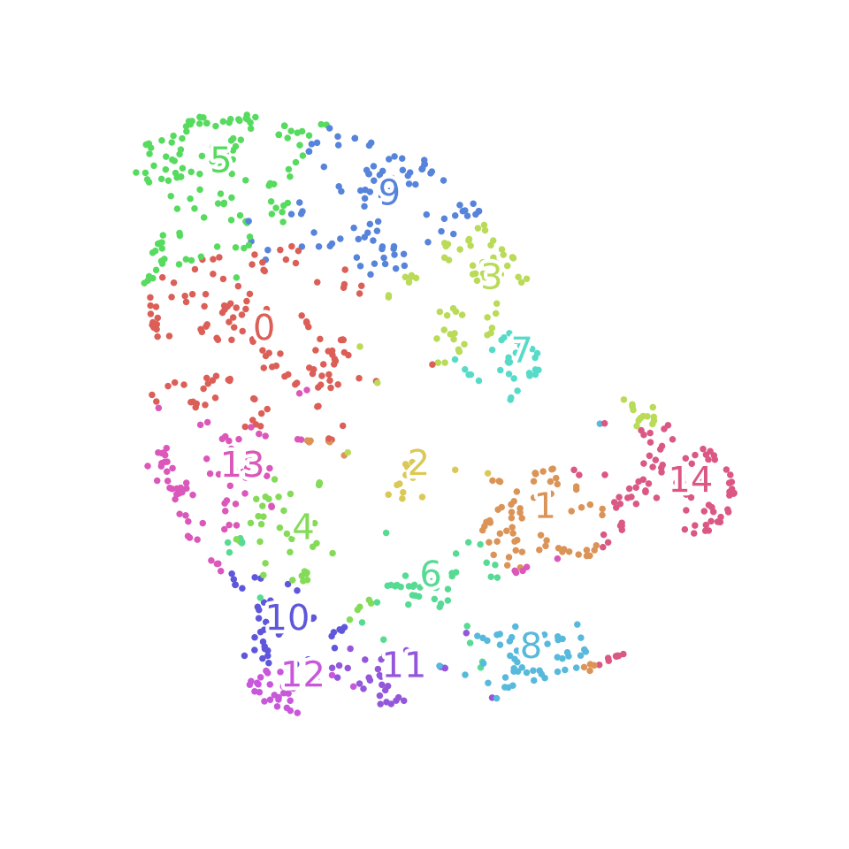

# Test task

### Goals

- Mining 1000 short text documents from web site
- Clustering the documents

### Requirements

- Programming language: Python
- Language of documents: Russian or English
- A small set of clusters

### Quick documentation

- `crawler.py` - web spider that crawl the quotes from `http://bash.org/?browse&p=01` pages; also you can specify your setting at head script: `#Shortcuts of settings for crawler`
- `clustering.ipynb` - iPython notebook for clustering short-jokes
- `requirements.txt` - requirement packages of project for python

### Usage for linux

From your projects directory run in console:

- `git clone https://github.com/exfool/text_clustering.git; `
- `cd ./text_clustering`

Crawler:

- `pip install -r requirements.txt`  - install all requirement packages
- `python ./crawler.py` - run crawler

Clustering:

- `python -m nltk.downloader all -d ~/nltk_data` - install [nltk][http://www.nltk.org/data.html] packages
- `docker run -d -p 8888:8888 -v $(pwd):/home/ds/notebooks -v ~/nltk_data:/usr/share/nltk_data dataquestio/python3-starter`  - run from project directory
- `http://localhost:8888/notebooks/clustering.ipynb` - jump to [ this link][http://localhost:8888/notebooks/clustering.ipynb] in your browser

### Work flow

1. Tokenizing with `nltk.word_tokenize` and Stemming with `SnowballStemmer("english")`
2. Extracting tf-idf features with `TfidfVectorizer`
3. Add hand-crafted features and scale like `[count: chars, words, lines, dots, questions...]`
4. Compute `cosine` documents similarity
5. Apply  `K-means` and `AffinityPropagation` methods to cosine distances
6. `TSNE` transformation for 2D visualization

### Results

TSNE transformation of cosine distances to visualization into 2D surface with parameters: 

​	`n_iter_without_progress=100, n_iter=5000, method='exact'`

#### K-mean

Parameters: 6 clusters, 5000 maximum number of iterations

examples of text in cluster [report/K_means.txt](report/K_means.txt)

#### AffinityPropagation

Parameters: 0.6 damping, -100 preference, 5000 maximum number of iterations

examples of text in cluster [report/AffinityPropagation.txt](report/AffinityPropagation.txt)

